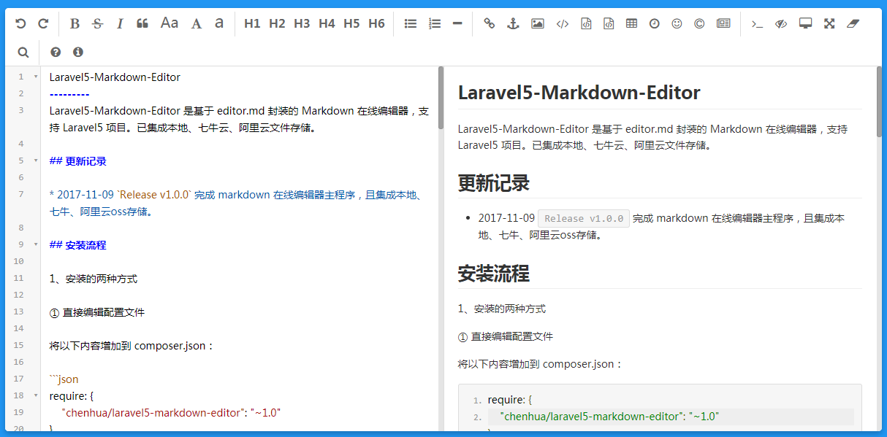

markdown-editor
---------
markdown-editor 是基于 editor.md 封装的 Markdown 在线编辑器，支持 Laravel 项目。

## 安装流程

1、命令行运行命令：

```bash
composer require leboclub/markdown-editor
```

2、发布资源

```bash
php artisan vendor:publish --tag=markdown
```

3、修改 `config/markdowneditor.php` 配置文件

```php
<?php

return [
    "default" => 'local', // 默认返回存储位置url

    "disks" => [

        "local"  => [
            'dirver' => 'local',
            'root' => 'uploads/images', // 本地存储位置，默认uploads
        ],
    ],
];
```

## 使用方法

### 在视图文件编辑器相应位置添加如下代码：

```html
<div id="editor">
    <textarea name="markdown" style="display:none;"></textarea>
</div>

@include('markdown::encode', ['editors' => ['editor']])
```
> 以上操作能生成一个 `name="markdown"` 的 `markdown` 文本编辑框，并能实时预览效果.

### 解析 `markdown` 格式文本为 `html` 格式

①  Laravel 辅助函数解析 `markdown` 文本

```php
echo str::markdown("#中间填写markdown格式的文本");
```

更多用法可以参考 `editor.md` 官方代码，[解锁更多姿势>>>](http://pandao.github.io/editor.md/)

### 效果展示

default样式：



## License
本扩展遵循 [MIT license](http://opensource.org/licenses/MIT) 开源。